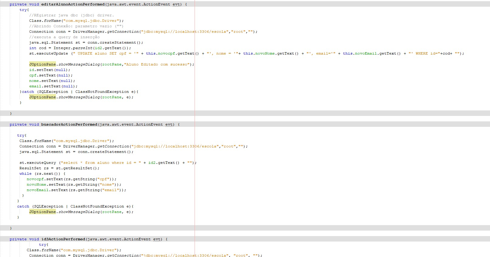
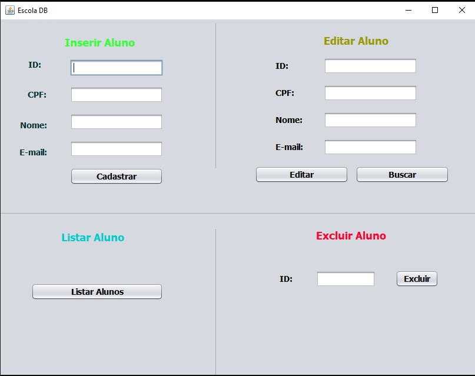
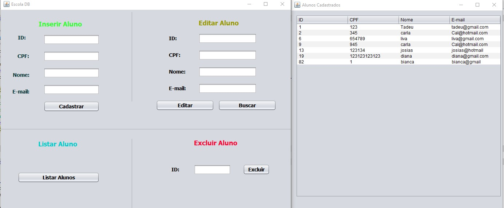
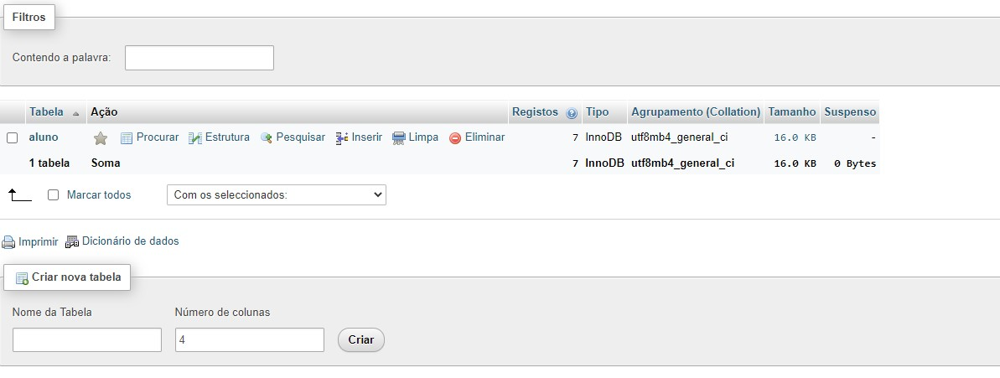

<h1>SISTEMA DE UMA ESCOLA - Java 🧮</h1>

<h2>Sistema de uma escola feito em JAVA feita em JAVA e JFrame</h2>

<h2>Explicação:</h2>

O Sitema dessa escola cadastra os alunos de uma instituição. Seguindo os conceitos do CRUD. Todas as imagens corresponden ao
do programa.

<h2>💻Tecnologias</h2>

- JAVA 

- JFrame 

- GIT e GitHub 

<h2>📱Contato</h2>

viktorariel777@gmail.com

